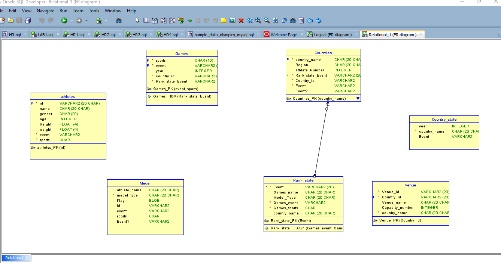

# Olympic 2020 - Database Systems Project Report

## 1. Final version of the E-R Model of the Project

### Figure 1.1: ER model of the project

### Figure 1.2: ER model of the project

## 2. Final Version of the Relational Data Model of the Project

### Figure 2.1: Relational Data model of the project

### Figure 2.2: Relational Data model of the project

## 3. Implementation Checklist

- Uploaded and Displayed Images in Reports: Yes (In MEDEL Page)
- Implemented Page-wise Authorization: Yes
- Number of Reports with Forms: 7
- Number of Master-detail Forms: 2
- Number of Reports based on Queries, Aggregate Queries: 2
- Number of Parameterized Reports: 2
- Number of Graphs/Charts: 4

**Additional Features:**
- Dashboard, activity report, email report, configuration option, theme style selection

**Unique Feature/Functionality:**
- **Athlete_Country Information report as a master table:** There have athlete information, and also you can get country information by searching as athlete_id.

## 4. Reports with Forms

| Report Page Number and Name | Form Page Number and Name | Table |
| ---------------------------- | ------------------------- | ----- |
| Athlete info (2)             | Athlete info (2)          | Athlete search parameterize |
| GAMES (4)                    | GAMES (4)                 | medel |
| Countries (6)                | Countries (6)             | Countries |
| Medel (12)                   | Medel (12)                | Medel |

### Figure 5.1: Athlete information

### Figure 5.2: Games report with form

### Figure 5.3: Countries report with form

### Figure 5.4: Medal report with form

## 5. Master-Detail Form

| Page Number and Name    | Master Table (Parent) | Detail Table (Child) |
| ----------------------- | --------------------- | -------------------- |
| Athlete-Country info (16) | Athlete info          | Countries            |
| Athlete-Rank state (19)   | Athlete info          | Rank state           |

### Figure 5.1: Athlete and Rank state Information

### Figure 5.2: Athlete-Country Information

## 6. Reports based on Multi-Table and Aggregate Queries

| Page Number and Name     | Query Type             | Report description |
| ------------------------ | ---------------------- | ------------------ |
| Athlete_country Info (16)| Athlete, country table | Provide you athlete and country information of each player. |
| Venue parameterized (25) | Venue, rank state      | Provide you venue information and rank state graph. |

### Figure 6.1: Athlete-Country Information

### Figure 6.2: Venue and Rank state Query

## 7. Parameterized Reports

| Page Number and Name    | Given Input | Report description                      |
| ----------------------- | ------------ | --------------------------------------- |
| Venue parameterized (25)| Venue_id     | Provide you venue information.          |
| Athlete search (8)      | Athlete_id   | Provide you athlete information         |

### Figure 7.1: Venue Parameterized

### Figure 7.2: ATHLETE SEARCH Parameterize

## 8. Charts

| Page Number and Name    | Chart description                                  |
| ----------------------- | -------------------------------------------------- |
| Olympic Dashboard (27)  | Three Charts there: VENUE CAPACITY NUMBER, Gender ratio, medal type |
| Venue parameterized     | Rank state statistics                              |

### Figure 8.1: Olympic Dashboard Chart

### Figure 8.2: Rank state Graph

## 9. Authorization and User Role Assignment

**User Role Assignment:**

| User name | Password    | Role          |
| --------- | ----------- | ------------- |
| sazzad    | Sazzad123   | Administrator |
| chadni    | Chadni123   | Reader        |

### Figure 9.1: User Access

**Page-wise Authorization Information:**

| Page number and name  | Authorization Level |
| --------------------- | ------------------- |
| P1. Home              | Reader              |
| P10000: Administration| Administrator       |
| Map                   | Reader              |
| Olympic dashboard     | Contributor Right   |

## 10. Concluding Remarks

Thank you for providing a unique experience and teaching us Oracle APEX well. Oracle APEX has helped build better apps with rich capabilities for data management, reporting, user interface, security, accessibility, monitoring, and globalization. It has been used to successfully provide solutions for real business problems across industries and geographies. From the simplest app that turns a spreadsheet into a web app, to mission critical apps that are accessed daily by hundreds of thousands of users. Oracle Apex is a very helpful platform, enabling easy creation of applications with robust user authentication, offering a range of features from parameterization to triggering, and much more. After all, the Oracle Apex application is definitely looking good after learning. Thank you for teaching us the Oracle Apex application very well. Thank you.

  
  

